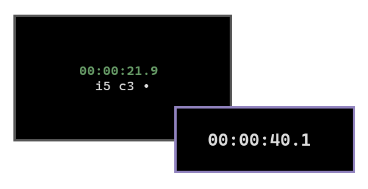

isw
===



a simple terminal stopwatch application.

this can be used for basic timing but also supports intervals for applications like pomodoro.

installation
------------

the app can be installed from [crates.io](https://crates.io) using the following command:

``` fish
cargo install isw
```

if cargo is configured correctly, the command should then be available in your path.

usage
-----

a few options are available on the command line. these can be listed using the help flag:

``` fish
isw -h
```
```
a simple terminal stopwatch application

Usage: isw [OPTIONS]

Options:
  -i, --intervals <INTERVALS>  Intervals to cycle colour on (comma-separated seconds)
  -c, --colours <COLOURS>      Colours to represent each interval (comma-separated ANSI colours (0-7))
  -d, --descending             Count down to each interval boundary
  -p, --pause                  Pause on interval boundaries (p or space to unpause)
  -s, --shell <SHELL>          Execute a shell command at the end of intervals ("%i for interval and %c for cycle")
      --show-interval          Show the number of intervals elapsed
      --show-cycle             Show the current number of interval cycles elapsed
  -h, --help                   Print help
  -V, --version                Print version
```
